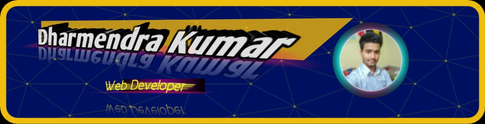

<h1 align="center"> Hii,  I'm Dharmendra Kumar</h1>

  

## 💫 About Me

- 😄 Pronouns: He/him
- 🔭 I'm currently working on a Fullstack Web Project
- 💬 Ask me about Java, Web Development or any tech-related stuff.
- 📫 How to reach me: Check the social links below.
- 👨‍💻 All of my projects are available at [https://github.com/dharmendra-kumar35](https://github.com/dharmendra-kumar35)

- 📫 How to reach me **dharmendracgs1234@gmail.com**

- ⚡ Fun fact **I am Funny**

## 🌐 Socials

## 💻 Languages and Tools:

          

## 📈 Activity Graph

    

## 💳 Github Profile Summary Card

  

## 📟 GitHub Stats

 
 

 
 

 
 

---

 <em><b>I love connecting with different people from around the world, so if you want to be my friend, feel free to [reach out](https://www.linkedin.com/in/dharmendrakumar35/) and introduce yourself (don't just say hi, tell me about yourself")</b> 😊 💜</em>

### Show some ❤️ by starring some of the repositories

